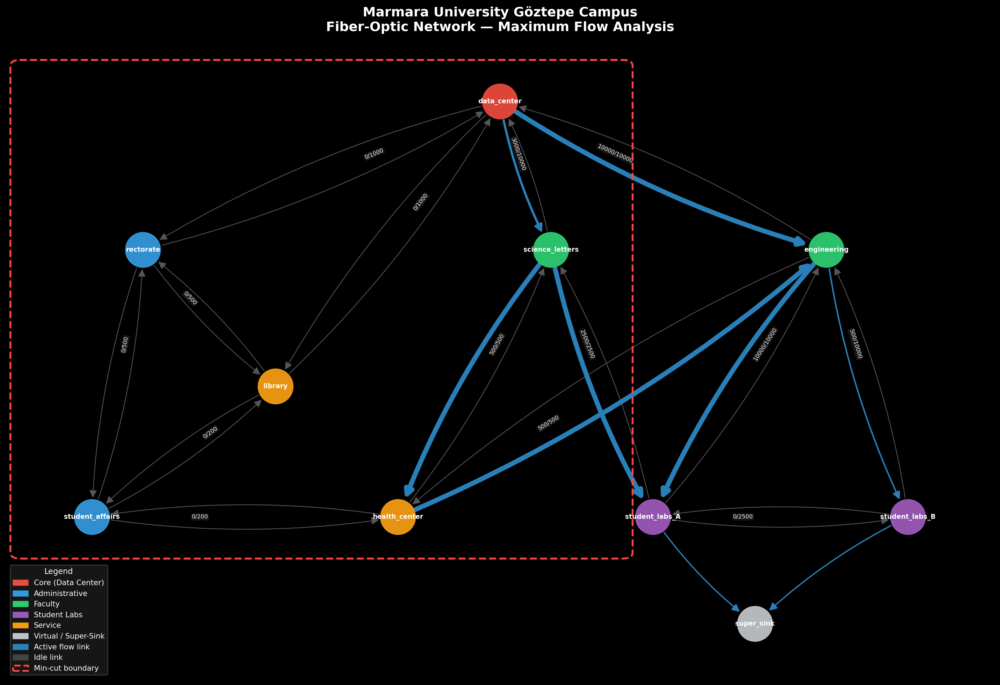

# Marmara University Göztepe Campus — Fiber-Optic Backbone Network Optimization

> **Course:** Management Information Systems | **Model:** Maximum Flow Problem | **Tool:** Python / NetworkX

---

## 1. Real-World Problem Context

Marmara University's Göztepe Campus in Istanbul is home to more than 20,000 students and approximately 1,500 academic and administrative staff. The campus encompasses a wide range of buildings — from the Faculty of Engineering and the Faculty of Science & Letters to the Central Library, Health Center, Student Affairs offices, and multiple blocks of computer laboratories used for coursework, thesis research, and online examinations.

The university's IT directorate is currently planning a **second-generation fiber-optic backbone** to replace the aging Fast-Ethernet infrastructure that was installed in the early 2000s. The central question they face is not merely *which buildings to connect* — that has already been determined by physical surveys — but rather **how much aggregate data throughput can be delivered from the Central Data Center to the student laboratories** given the physical capacity constraints of each proposed cable segment.

This question becomes especially acute during examination periods (vize/final haftası), when hundreds of students simultaneously stream lecture recordings, submit online assignments, and use cloud-based simulation software. A poorly designed backbone that saturates during peak hours imposes direct academic costs: delayed submissions, broken video-conference sessions with remote faculty, and failed access to digital library resources.

The IT directorate has contracted a preliminary topology study that identified nine candidate nodes and fourteen candidate bidirectional fiber links. Budget constraints mean that not every link can be upgraded to the highest available transceiver standard (10 GbE), so the team must identify *which specific links are bottlenecks* and prioritize upgrade spending accordingly.

---

## 2. Problem Definition

**Formal problem statement:**

Given a directed network graph $G = (V, E)$ representing the proposed Marmara University Göztepe Campus fiber-optic topology, where each directed edge $(u, v) \in E$ carries a capacity $c(u,v)$ measured in Megabits per second (Mbps), find the **maximum volume of data** that can be routed simultaneously from the Central Data Center (source node $s$) to the Student Laboratory complex (sink node $t$) without violating any edge capacity constraint.

**Secondary objective:** Identify the **minimum cut** — the set of edges whose combined capacity equals the maximum flow and whose removal would completely disconnect the source from the sink. These edges represent the highest-priority upgrade targets from a capital expenditure perspective.

**Constraints:**
- Flow conservation: at every intermediate node $v \notin \{s, t\}$, total inflow equals total outflow.
- Capacity constraint: flow on any edge $(u, v)$ cannot exceed $c(u, v)$.
- Non-negativity: flow values are non-negative real numbers.

---

## 3. Network Model

This project uses the **Maximum Flow Problem**, solved via the **Edmonds-Karp algorithm** (a BFS-based implementation of the Ford-Fulkerson method).

**Why Maximum Flow — not MST or Shortest Path?**

| Criterion | Max Flow | MST | Shortest Path |
|---|---|---|---|
| Question answered | How much? | At what cost? | How fast/cheap? |
| Bottleneck identification | ✅ Direct (min-cut theorem) | ❌ | ❌ |
| Capacity planning relevance | ✅ High | Moderate | Low |
| Suitable for bandwidth design | ✅ Yes | No | No |

The Maximum Flow model is the correct formulation here because the IT directorate's core concern is **bandwidth saturation**, not cable cost minimization or routing efficiency in isolation.

**Algorithm choice — Edmonds-Karp:**
- Guaranteed polynomial time: $O(|V| \cdot |E|^2)$
- Deterministic (BFS always finds shortest augmenting path)
- Provably optimal (produces the true maximum flow)
- Available natively in NetworkX as `nx.algorithms.flow.edmonds_karp`

**The Max-Flow Min-Cut Theorem** guarantees that the value of the maximum flow equals the capacity of the minimum cut. This means solving the flow problem simultaneously solves the bottleneck identification problem — a two-for-one analytical result of direct managerial relevance.

---

## 4. Nodes and Edges

### Nodes (9 total)

| Node ID | Real-World Location | Type | Role in Model |
|---|---|---|---|
| `data_center` | Central server room, main IT building | Core | **Source** $s$ |
| `rectorate` | Rektörlük (Administration) building | Admin | Transit hub |
| `engineering` | Mühendislik Fakültesi building | Faculty | Major transit & distribution |
| `science_letters` | Fen-Edebiyat Fakültesi building | Faculty | Major transit & distribution |
| `library` | Merkez Kütüphane | Service | Transit hub |
| `student_affairs` | Öğrenci İşleri building | Admin | Transit hub |
| `student_labs_A` | Computer labs block A (east wing) | Lab | **Sink** (real) |
| `student_labs_B` | Computer labs block B (west wing) | Lab | **Sink** (real) |
| `health_center` | Sağlık Merkezi | Service | Transit hub |
| `super_sink` | Virtual aggregation node | Virtual | **Sink** $t$ (model only) |

> `super_sink` is a modelling artifact. Both `student_labs_A` and `student_labs_B` are connected to it with infinite-capacity arcs, allowing the solver to treat them as a single aggregated demand point.

### Edges (14 physical links → 28 directed arcs)

Each physical fiber run is modelled as two directed arcs (bidirectional). The table below lists the 14 physical links.

| Link | Distance (m) | Capacity (Mbps) | Transceiver Class | Est. Cost (₺) |
|---|---|---|---|---|
| data_center → rectorate | 420 | 1,000 | 1 GbE | 63,000 |
| data_center → engineering | 380 | 10,000 | 10 GbE | 57,000 |
| data_center → science_letters | 510 | 10,000 | 10 GbE | 76,500 |
| data_center → library | 290 | 1,000 | 1 GbE | 43,500 |
| rectorate → student_affairs | 180 | 500 | 500 MbE | 27,000 |
| rectorate → library | 230 | 500 | 500 MbE | 34,500 |
| engineering → student_labs_A | 150 | 10,000 | 10 GbE | 22,500 |
| engineering → student_labs_B | 210 | 10,000 | 10 GbE | 31,500 |
| science_letters → student_labs_A | 200 | 2,500 | 2.5 GbE | 30,000 |
| science_letters → health_center | 350 | 500 | 500 MbE | 52,500 |
| library → student_affairs | 160 | 200 | 200 MbE | 24,000 |
| student_labs_A → student_labs_B | 120 | 2,500 | 2.5 GbE | 18,000 |
| health_center → student_affairs | 400 | 200 | 200 MbE | 60,000 |
| engineering → health_center | 480 | 500 | 500 MbE | 72,000 |

**Total estimated infrastructure cost: ₺612,000**

---

## 5. Selected Algorithm

### Maximum Flow — Edmonds-Karp Algorithm

The Edmonds-Karp algorithm is a specific implementation of the Ford-Fulkerson method where the augmenting path is always found using **Breadth-First Search (BFS)**. This guarantees that the shortest augmenting path (in terms of number of edges) is selected at each iteration.

**Algorithm steps:**
1. Initialize all edge flows to zero.
2. Find an augmenting path from $s$ to $t$ using BFS on the **residual graph** $G_f$.
3. Identify the bottleneck capacity $\Delta = \min_{(u,v) \in P} r_f(u,v)$ along the path.
4. Update flow: $f(u,v) \mathrel{+}= \Delta$ for forward edges, $f(v,u) \mathrel{-}= \Delta$ for backward edges.
5. Update the residual graph accordingly.
6. Repeat from step 2 until no augmenting path exists.
7. The minimum cut is found by BFS reachability from $s$ in the final residual graph $G_f$.

**Complexity:** $O(|V| \cdot |E|^2)$ — guaranteed regardless of capacity values, unlike the basic Ford-Fulkerson which depends on flow magnitudes.

---

## 6. Python Implementation

The implementation is organized in `src/solution.py` with the following modular structure:

```
load_network()      ← Parse CSV into a NetworkX DiGraph
add_super_sink()    ← Add virtual aggregation node for multi-sink problem
solve_max_flow()    ← Run Edmonds-Karp via nx.maximum_flow()
find_min_cut()      ← Identify bottleneck edges via nx.minimum_cut()
visualise()         ← Render graph with flow/capacity labels → PNG
write_results()     ← Persist full solution report → TXT
main()              ← Orchestrate all steps
```

**Key library calls:**
```python
# Solve max flow (Edmonds-Karp)
flow_value, flow_dict = nx.maximum_flow(G, source, sink,
                            flow_func=nx.algorithms.flow.edmonds_karp)

# Find minimum cut (same call, different function)
cut_value, (reachable, non_reachable) = nx.minimum_cut(G, source, sink)
```

Both calls internally use the same residual graph, so the min-cut is obtained at no additional computational cost.

---

## 7. Results

### Maximum Flow

> **Total maximum achievable throughput: 13,000 Mbps (13 Gbps)**

This means that, under the proposed topology and its capacity constraints, the campus backbone can deliver a combined maximum of **13 Gbps** simultaneously to the student laboratory complex.

### Saturated Links (100% utilisation)

| Edge | Flow | Capacity | Utilisation |
|---|---|---|---|
| data_center → engineering | 10,000 Mbps | 10,000 Mbps | **100%** |
| engineering → student_labs_A | 10,000 Mbps | 10,000 Mbps | **100%** |
| science_letters → student_labs_A | 2,500 Mbps | 2,500 Mbps | **100%** |
| science_letters → health_center | 500 Mbps | 500 Mbps | **100%** |

### Minimum Cut (Bottleneck Set)

The min-cut separates the network into two sides:

- **Source side:** `data_center`, `science_letters`, `health_center`, `rectorate`, `library`, `student_affairs`
- **Sink side:** `engineering`, `student_labs_A`, `student_labs_B`

**Bottleneck edges crossing the cut:**

| Bottleneck Edge | Capacity |
|---|---|
| `health_center → engineering` | 500 Mbps |
| `science_letters → student_labs_A` | 2,500 Mbps |
| `data_center → engineering` | 10,000 Mbps |

**Total cut capacity: 500 + 2,500 + 10,000 = 13,000 Mbps** ✓ (confirms max-flow = min-cut)

### Network Visualization



*Edge labels show `flow/capacity` in Mbps. Blue edges carry active flow; grey edges are idle. Dashed red boundary shows the source side of the minimum cut.*

---

## 8. Managerial Interpretation

### Executive Summary

The maximum flow analysis reveals that the proposed Marmara University Göztepe Campus fiber-optic backbone can deliver **13 Gbps of simultaneous throughput** to the student laboratory complex under its current design. While this figure may appear sufficient in absolute terms, the minimum cut analysis uncovers a critical structural vulnerability that carries direct implications for capital expenditure planning and service-level assurance.

### Key Finding: Asymmetric Path Dependency

The analysis identifies that **virtually all high-capacity traffic to the labs flows through a single path:** `data_center → engineering → student_labs_A/B`. The `data_center → engineering` link, provisioned at 10 GbE, is fully saturated in the optimal flow solution. This creates a **single point of failure** in the network's highest-capacity corridor. A fiber cut, transceiver failure, or even scheduled maintenance on this single segment would reduce laboratory-accessible bandwidth from 13 Gbps to a mere **3 Gbps** — a 77% degradation that would render the labs unusable during peak examination periods.

### Strategic Recommendations

**Priority 1 — Redundancy investment (Risk Management):**
The IT directorate should provision a second physical fiber conduit between the Data Center and the Engineering building via an alternate campus route (e.g., underground through the courtyard). The cost of a second 10 GbE transceiver pair (~₺57,000) is negligible compared to the reputational and academic cost of a network outage during the final examination week.

**Priority 2 — Throughput scaling (Capacity Planning):**
Upgrading the `science_letters → student_labs_A` link from 2.5 GbE to 10 GbE (currently the second binding bottleneck at 2,500 Mbps saturation) would increase total maximum flow from 13 Gbps to **20.5 Gbps** — a 58% increase for a relatively modest incremental cost, as the conduit is already in place.

**Priority 3 — Administrative corridor rationalization (Cost Optimization):**
The analysis reveals that links through `rectorate`, `library`, and `student_affairs` carry **zero flow** in the optimal solution. These paths have capacities ranging from 200–500 Mbps, which the algorithm correctly bypasses in favor of higher-capacity routes. Management should consider whether these links serve non-lab traffic (e.g., administrative VoIP, printer traffic) before decommissioning them, but they should not be upgraded under the assumption that they contribute to student lab capacity.

**Priority 4 — Dynamic traffic management (Operations):**
During non-examination periods, real-time traffic monitoring (e.g., via NetFlow/IPFIX collection at the `data_center` node) should be implemented to detect early saturation of the `data_center → engineering` link. If sustained utilisation exceeds 70%, automated Quality of Service (QoS) policies should deprioritize non-academic traffic (streaming, social media) to preserve headroom for academic applications.

### Connection to MIS Theory

From an MIS perspective, this analysis exemplifies the application of **Operations Research methods to Information Infrastructure Management** — a sub-domain of IT governance. The minimum cut result operationalizes the concept of a **system bottleneck** from Theory of Constraints (Goldratt, 1984) in a network context: the maximum sustainable throughput of the entire campus information system is bounded by its weakest high-capacity link, regardless of the design quality elsewhere in the topology. Investments made anywhere other than the bottleneck yield zero improvement in system output — a result that is counterintuitive to non-technical stakeholders but mathematically provable through the Max-Flow Min-Cut Theorem.

---

## 9. How to Run the Code

### Prerequisites

- Python 3.9 or higher
- pip

### Installation

```bash
# 1. Clone the repository
git clone https://github.com/YOUR_USERNAME/mis-network-optimization-project.git
cd mis-network-optimization-project

# 2. (Recommended) Create and activate a virtual environment
python -m venv venv
source venv/bin/activate        # macOS / Linux
# venv\Scripts\activate         # Windows

# 3. Install dependencies
pip install -r requirements.txt
```

### Run the Solver

```bash
python src/solution.py
```

**Expected outputs:**
- `results/network_visualization.png` — Graph visualization with flow labels
- `results/solution_output.txt` — Full tabular solution report

### Running the Jupyter Notebook

```bash
jupyter notebook notebooks/analysis.ipynb
```

The notebook walks through each step interactively with markdown explanations between code cells.

---

## 10. References

See [`references/references.md`](references/references.md) for the full annotated bibliography.

**Key references:**
- Ahuja, R. K., Magnanti, T. L., & Orlin, J. B. (1993). *Network Flows: Theory, Algorithms, and Applications.* Prentice-Hall.
- Edmonds, J., & Karp, R. M. (1972). Theoretical improvements in algorithmic efficiency for network flow problems. *Journal of the ACM, 19*(2), 248–264.
- Ford, L. R., & Fulkerson, D. R. (1956). Maximal flow through a network. *Canadian Journal of Mathematics, 8*, 399–404.
- Hagberg, A., Swart, P., & Chult, D. (2008). Exploring network structure, dynamics, and function using NetworkX. *Proceedings of the 7th Python in Science Conference (SciPy)*, 11–15.
- Goldratt, E. M. (1984). *The Goal: A Process of Ongoing Improvement.* North River Press.
- Marmara University. (2024). *Kurumsal Bilgi.* https://www.marmara.edu.tr
